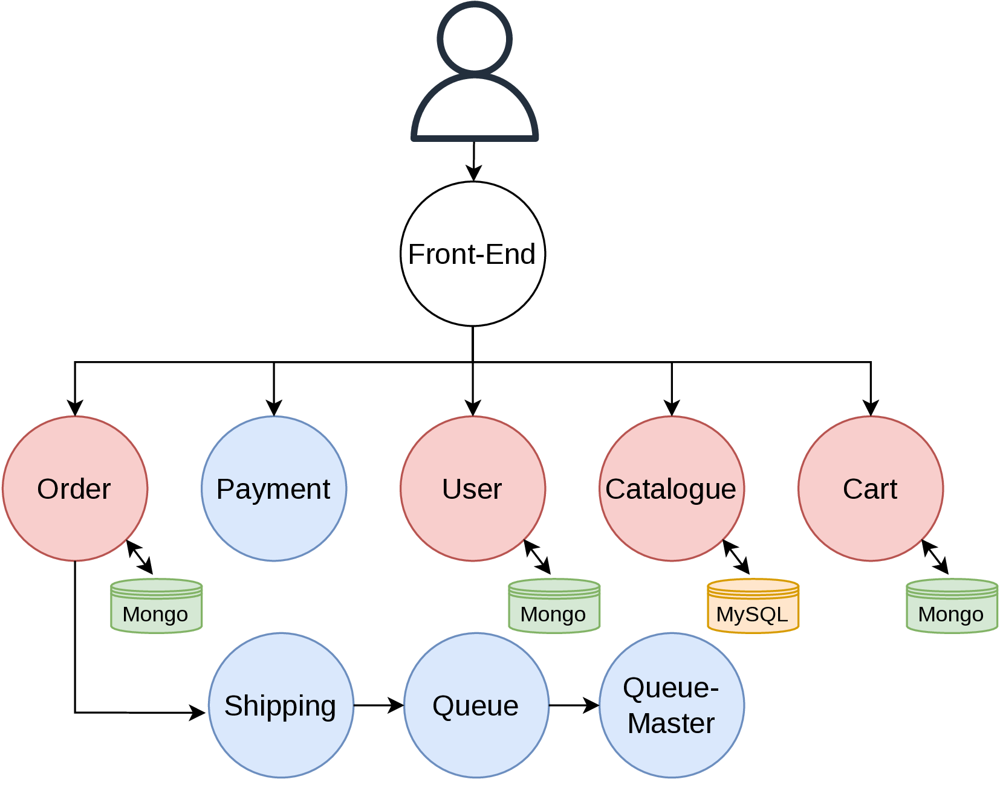

# AISE_Sockshop

The purpose of this tutorial is to provide a brief introduction to microservices, with a particular focus on their deployment. Specifically, we will deploy the [SockShop](https://github.com/microservices-demo/microservices-demo) application locally. **SockShop** is a well-known microservices-based benchmarking application. The deployment will be carried out using [Docker](https://www.docker.com/) and [Kubernetes](https://kubernetes.io/). In addition, this tutorial will include a short background on these tools to help contextualize the process.

## Microservices

Microservices are an **architectural style** for building applications as a collection of small, independent services that work together. Each service is designed to perform a **specific function**, and they communicate with each other through lightweight mechanisms such as **HTTP APIs** or **messaging systems**.

### Key Characteristics
- **Independence**: Each microservice can be developed, deployed, and scaled independently.  
- **Specialization**: A microservice is focused on solving a single business capability.  
- **Communication**: Services interact through well-defined interfaces, often using REST, gRPC, or message queues.  
- **Resilience**: The failure of one service does not necessarily bring down the whole system.  
- **Technology Flexibility**: Different microservices can be built using different programming languages, frameworks, or databases.  

### Advantages
- **Scalability**: Only the services under heavy load need to be scaled.  
- **Faster Development**: Teams can work on different services in parallel.  
- **Flexibility in Technology**: Teams can choose the best technology for each service.  
- **Improved Fault Isolation**: Failures are contained within a single service.  

## SockShop

The application is the user-facing part of an online shop that sells socks.




In this architecture, the functionalities of the application are decomposed into distinct components, ensuring the **independence** and the **specializzation** of the microservices.
. Each microservice is responsible for a specific function. For example, the *Order* service manages customer orders, while the *User* service handles authentication, and so on.  

Another important aspect to highlight is the **decentralization of data**: the *Order*, *User*, *Cart*, and *Catalogue* services each maintain their own dedicated database (using MongoDB or MySQL), ensuring data ownership and independence across services.

The microservices highlighted in red in the image are referred to as **edge services**, as they expose REST APIs. These services act as entry points, allowing external requests to be sent directly to them. In this way, the frontend application interacts with the system by consuming these APIs to render and manage the web interface.

## Deploy with Docker compose

## Introduction to Docker

**Docker** is an open-source platform designed to simplify the process of building, deploying, and running applications. It enables developers to package an application and its dependencies into a standardized unit called a **container**. Containers are lightweight, portable, and consistent across different environments, ensuring that an application behaves the same way in development, testing, and production.

### Why Docker?

Traditionally, deploying an application required setting up servers, installing dependencies, and ensuring that configurations matched across environments. This often led to the classic issue of *"it works on my machine, but not in production."* Docker addresses this problem by isolating applications inside containers that run independently of the host system’s configuration.

### Key Features

- **Portability:** Containers can run on any system that has Docker installed, regardless of the underlying OS.  
- **Isolation:** Each container runs in its own environment, independent from others.  
- **Lightweight:** Containers share the host system’s kernel, making them more efficient than virtual machines.  
- **Scalability:** Containers can be easily replicated and orchestrated, which is essential for modern distributed applications.  

### Docker in Practice

With Docker, developers can:  
- Create container images that package their code with the required dependencies.  
- Run these images consistently across local machines, servers, or cloud environments.  
- Use tools like **Docker Compose** to manage multi-container applications.  

### Dockerfile

A **Dockerfile** is a text file that contains a set of instructions to build a Docker image. It defines the environment, dependencies, and steps required to package an application into a container. Using a Dockerfile ensures that the application can be built and run consistently across different environments.

### Key Concepts

- **FROM:** Specifies the base image to use (e.g., an official Python or Node.js image).  
- **RUN:** Executes commands in the container during the build process, such as installing packages.  
- **COPY / ADD:** Copies files from the host system into the image.  
- **WORKDIR:** Sets the working directory inside the container.  
- **CMD / ENTRYPOINT:** Defines the command to run when the container starts.  
- **EXPOSE:** Indicates the ports the container will listen on.


## Simple Dockerfile Example

This is a minimal Dockerfile that runs a basic Python application:

```dockerfile
# Use the official Python base image
FROM python:3.10-slim

# Set the working directory inside the container
WORKDIR /app

# Copy the application file into the container
COPY app.py .

# Run the application
CMD ["python", "app.py"]
```


The app.py can contains all you want, for example a simple Hello World code.

```python
print('Hello World')
```

```bash
cd example_app
docker build -t helloworld-app-image .
docker run my-python-app
```

-t allows to specify a tag (a name) for the image built
docker build requires one mandatory parameter, the path of the application that we want to build. IN our case, we specify '.' because we are in the directory *example_app*.

This is the ouput of buld command
```bash
~/VSCode/AISE_Sockshop/example_app | main ?1 ........................................... base py | 18:21:16 
> docker build -t helloworld-app-image .
[+] Building 14.0s (8/8) FINISHED                                                              docker:default
 => [internal] load build definition from Dockerfile                                                     0.1s
 => => transferring dockerfile: 267B                                                                     0.0s
 => [internal] load metadata for docker.io/library/python:3.10-slim                                      1.2s
 => [internal] load .dockerignore                                                                        0.1s
 => => transferring context: 2B                                                                          0.0s
 => [1/3] FROM docker.io/library/python:3.10-slim@sha256:77f72bc159950ab208b8bbb9a7b22868984e004ce6296  11.1s
 => => resolve docker.io/library/python:3.10-slim@sha256:77f72bc159950ab208b8bbb9a7b22868984e004ce62966  0.2s
 => => sha256:8c7716127147648c1751940b9709b6325f2256290d3201662eca2701cadb2cdf 29.78MB / 29.78MB         4.9s
 => => sha256:77f72bc159950ab208b8bbb9a7b22868984e004ce62966d1ca9268c346c73c64 10.37kB / 10.37kB         0.0s
 => => sha256:594ef156eb80e7992517eadae6c4561f4618b9c325212de8340092c240561c99 1.75kB / 1.75kB           0.0s
 => => sha256:9563b85a1cdb96ac92378a42783b14b831a57c0d9f032755dc7eb6a3e06a94ac 5.38kB / 5.38kB           0.0s
 => => sha256:272601b5d1249da83ab4357de0e6ad424ac44d4c0a59588c45f262eaaff69658 1.29MB / 1.29MB           1.0s
 => => sha256:292f9797b277991b13625a46aafe0585df56e1e50c4a01a51e36f6bb24c766a8 14.10MB / 14.10MB         5.1s
 => => sha256:d69292a5b8f1a7a6536d98dcd1bb927f681aad9e80bb88c0f87cbf1c6dcad632 250B / 250B               1.4s
 => => extracting sha256:8c7716127147648c1751940b9709b6325f2256290d3201662eca2701cadb2cdf                2.4s
 => => extracting sha256:272601b5d1249da83ab4357de0e6ad424ac44d4c0a59588c45f262eaaff69658                0.1s
 => => extracting sha256:292f9797b277991b13625a46aafe0585df56e1e50c4a01a51e36f6bb24c766a8                1.1s
 => => extracting sha256:d69292a5b8f1a7a6536d98dcd1bb927f681aad9e80bb88c0f87cbf1c6dcad632                0.0s
 => [internal] load build context                                                                        0.1s
 => => transferring context: 85B                                                                         0.0s
 => [2/3] WORKDIR /app                                                                                   0.2s
 => [3/3] COPY app .                                                                                     0.3s
 => exporting to image                                                                                   0.6s
 => => exporting layers                                                                                  0.6s
 => => writing image sha256:1e0ab1d35aa16dc371f799aebccc18ab2ddc06b837c6f9bb435f136de7083cc4             0.0s
 => => naming to docker.io/library/helloworld-app-image
```

Visualizing the build image
```bash
> docker images
REPOSITORY             TAG                          IMAGE ID       CREATED              SIZE
helloworld-app-image   latest                       1e0ab1d35aa1   About a minute ago   122MB
vllm                   latest                       0f6e3d688d9f   13 days ago          17.2GB
nvidia/cuda            12.2.0-runtime-ubuntu22.04   5f87b1ee9f9a   23 months ago        1.97GB
```

```
 ~/VSCode/AISE_Sockshop/example_app | main ?1 ................................................................................ base py | 18:29:43 
> docker run --name helloworld-app-container helloworld-app-image 
Hello World!
```

Visualiazing the containers 
```bash
> docker ps -a
CONTAINER ID   IMAGE                  COMMAND           CREATED          STATUS                      PORTS     NAMES
4f1cdbd42c10   helloworld-app-image   "python app.py"   54 seconds ago   Exited (0) 53 seconds ago             helloworld-app-container
31115bd3c3fc   vllm                   "bash"            13 days ago      Created                               loving_jang
d88daa7ce0b2   vllm                   "bash"            13 days ago      Created                               vigilant_mcnulty
2d71d87190e6   vllm                   "bash"            13 days ago      Exited (127) 13 days ago              silly_jones
f389b5625bc7   vllm                   "bash"            13 days ago      Created                               quirky_darwin
```

Removing the stop/container
```bash
docker stop helloworld-app-container
docker rm helloworld-app-container
```


## Deploy Flake Example

The *flask_example* directory provides a skeleton application that returns a list of random numbers when a forecast is requested.  

This directory contains the file *app.py*, which defines the web application gateway using [Flask](https://github.com/pallets/flask).


From the official repository
```
Flask is a lightweight WSGI web application framework. It is designed to make getting started quick and easy, with the ability to scale up to complex applications. It began as a simple wrapper around Werkzeug and Jinja, and has become one of the most popular Python web application frameworks.

Flask offers suggestions, but doesn't enforce any dependencies or project layout. It is up to the developer to choose the tools and libraries they want to use. There are many extensions provided by the community that make adding new functionality easy.
```

The *Dockerfile* defines the container image by employing a two-stage build process:
- **Stage 1 (Builder):** Installs all required dependencies.  
- **Stage 2 (App):** Copies only the files necessary for running the application.  

This approach ensures that the final image contains only the essential files needed for execution, resulting in a cleaner and more efficient container, free from build dependencies and caching artifacts.  

Furthermore, the *Dockerfile* exposes the application on port **5000**.

```bash
cd flask_example
docker build -t flaskexampleimg .
docker run -p 2557:5000 --name flaskexample flaskexampleimg
```
The `docker run` command includes the `-p` parameter, which specifies port mapping between the host and the container.  
This mapping is necessary because, although the container exposes port **5000**, it must be explicitly linked to a host port to be accessible from outside the container.  

In this example, the container’s port **5000** is mapped to port **2557** on the host machine.  
As a result, the containerized application can be reached by sending requests to `localhost:2557` on the host.


Example of request
```bash
>   curl -X POST 127.0.0.1:2557/forecast -H "Content-Type: application/json" -d '{"store_number": 10, "forecast_start_date": "2023-07-01T00:00:00"}'
{
  "result": [
    0.4660337420841456,
    0.5775985641661946,
    0.8690943155178295,
    0.7254666001821155,
    0.5901715613974032,
    0.5769412559594309,
    0.9130254408840146,
    0.8880826713090817,
    0.9491970391212761,
    0.6880695486096878
  ],
  "store_number": 10
}

```
## Deploy SockShop with Docker

As seen in the previous section, SockShop is a more complex application.  
In the previous examples, we deployed single-container applications.  

In this section, we will focus on deploying and running a multi-container application, using SockShop as example.


SockShop is devided in many repository, each one for each microservice and a 'main' repository that contains the configuration for deploying the entire application. 
A multi-containers application can be deployied by deolpying each container a time. But, it is simple to understand, that with huge application is impossibile. 
So, Docker provides a tool (Docker Compose) for automatically and in one step deploying an entire application. Docker Compose requires a configuration file (.yml) that defines all the infromation necessary for the deployment. 


The following is a snippet of a Docker Compose configuration file.  
Two services are defined: `catalogue` and `catalogue-db`.  

For each service, the configuration specifies:  
- The container image  
- The hostname  
- Environment variables  

Network settings can also be defined within the configuration.  
In the case of SockShop, the ports exposed by each container are specified in the corresponding Dockerfile.


```yml
services:
  catalogue:
    image: weaveworksdemos/catalogue:0.3.5
    hostname: catalogue
    restart: always
    cap_drop:
      - all
    cap_add:
      - NET_BIND_SERVICE
    read_only: true
  catalogue-db:
    image: weaveworksdemos/catalogue-db:0.3.0
    hostname: catalogue-db
    restart: always
    environment:
      - MYSQL_ROOT_PASSWORD=${MYSQL_ROOT_PASSWORD}
      - MYSQL_ALLOW_EMPTY_PASSWORD=true
      - MYSQL_DATABASE=socksdb
```


For deploying dockshop, we need to clone the [main repository](https://github.com/microservices-demo/microservices-demo). 

```bash
cd deploy/docker-compose
docker compose up -d
```

The Docker Compose configuration file defines also the port mapping, so the application is accessible from (http://localhost:80)

Testing the api

```bash
> curl http://localhost:80/catalogue/03fef6ac-1896-4ce8-bd69-b798f85c6e0b 
{"id":"03fef6ac-1896-4ce8-bd69-b798f85c6e0b","name":"Holy","description":"Socks fit for a Messiah. You too can experience walking in water with these special edition beauties. Each hole is lovingly proggled to leave smooth edges. The only sock approved by a higher power.","imageUrl":["/catalogue/images/holy_1.jpeg","/catalogue/images/holy_2.jpeg"],"price":99.99,"count":1,"tag":["magic","action"]}
```


## Deploy with Kubernetes

## Introduction to Kubernetes

Kubernetes is an open-source platform designed to automate the deployment, scaling, and management of containerized applications. It provides a framework for running distributed systems reliably and efficiently.  

### Key Advantages

- **Automated Scaling:** Kubernetes can automatically scale applications up or down based on demand.  
- **Self-Healing:** Containers that fail or become unresponsive are automatically restarted or replaced.  
- **Service Discovery & Load Balancing:** Kubernetes can expose containers using DNS names or IP addresses and distribute network traffic across multiple instances.  
- **Declarative Configuration:** The desired state of the system can be defined in configuration files, allowing Kubernetes to maintain that state automatically.  
- **Portability:** Kubernetes works with various container runtimes and cloud providers, ensuring applications can run consistently across different environments.  

### Core Functionality

- **Container Orchestration:** Manages the lifecycle of containers, including deployment, updates, and rollback.  
- **Networking & Service Management:** Provides internal networking, service discovery, and load balancing between containers.  
- **Storage Orchestration:** Automates mounting and management of storage resources for containers.  
- **Resource Management:** Efficiently schedules containers based on available CPU, memory, and other resources.  

Kubernetes is widely adopted for running complex, production-grade applications with high availability, scalability, and resilience.


Minikube.....

YAML ....
    Service...
    POD...
    Replica...

Deploy flask example....

devo fare il build da dentro minikube, perche?

minikube start --memory 8196

eval $(minikube docker-env)

 DOCKER_BUILDKIT=0  docker build  -t flaskappimg .

minikube kubectl -- apply -f ./k8s_flaskappimg.yaml

minikube kubectl -- get pods
minikube kubectl -- get services

minikube service flask-app-service --url

minikube kubectl -- delete -f ./k8s_flaskappimg.yaml

Deploy SockShop...

```bash
minikube kubectl -- apply -f ./deploy/kubernetes/complete-demo.yaml

minikube kubectl -- get pods -n sock-shop
minikube kubectl -- get services -n sock-shop

minikube service front-end --url -n sock-shop
```

Forse bisogna aumentare la memodia per minikube
minikube stop
minikube config set memory 4096
minikube start


minikube kubectl -- get pods -n sock-shop

minikube kubectl -- delete namespace sock-shop